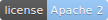

# Looking Glass



## 简介

Looking Glass（镜之门）为 Android 开发模版代码封装的开发工具包

## 模块列表

- **Looking Glass Architecture**
  
  Android Architecture Components（AAC）架构相关模版与工具包
  
  [详见模块 README](lookinglass-architecture/readme.md)

- **Looking Glass Logcat**
  
  日志打印工具
  
  *依赖 Looking Glass Core*
  
  [详见模块 README](lookinglass-logcat/readme.md)

- **Looking Glass Tools**
  
  实用工具整合（如线程调度、Shared Preferences 读写等）
  
  *依赖 Looking Glass Core*
  
  [详见模块 README](lookinglass-tools/readme.md)

- **Looking Glass Widget**
  
  实用控件整合
  
  [详见模块 README](lookinglass-widget/readme.md)

## 独立模块

*独立模块为 Looking Glass 工具包的一部分，但不集成到 lookinglass 主模块中*

- Tale
  
  RecyclerView 数据类型视图互绑定工具
  
  [详见模块 Repository](https://github.com/AoraMD/Tale)

## 特殊模块列表

- **Looking Glass Core**
  
  相关 Looking Glass 模块依赖核心组件，*不作为单独模块提供*
  
  [详见模块 Repository](https://github.com/AoraMD/LookingGlassCore)

- **Wonderland**
  
  Looking Glass 系列模块部署工具
  
  [详见模块 README](wonderland/readme.md)

## 依赖添加

在 Gradle 中添加远程仓库链接

```groovy
repositories {
    ...
    maven {
        url "https://raw.githubusercontent.com/AoraMD/MavenRepository/master"
    }
}
```

在模块中添加依赖

```groovy
dependencies {
    ...
    implementation 'moe.aoramd.lookinglass:$module:$version@aar'
}
```
